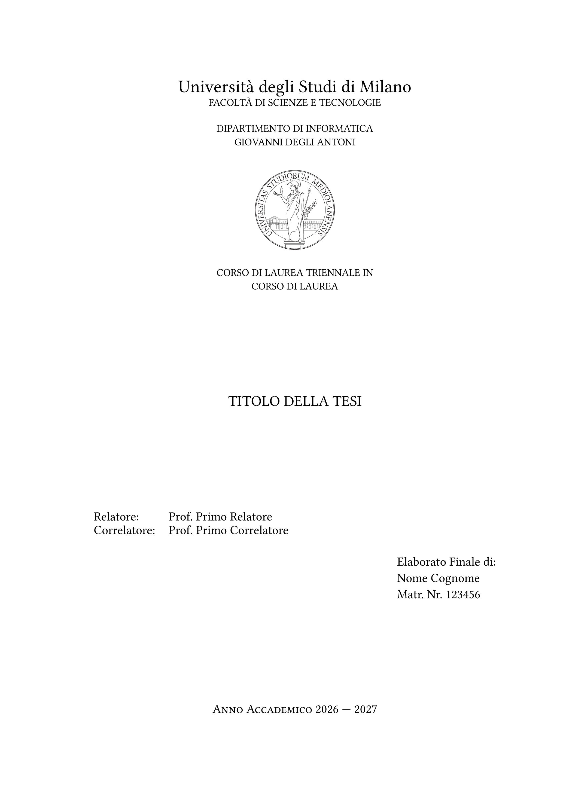
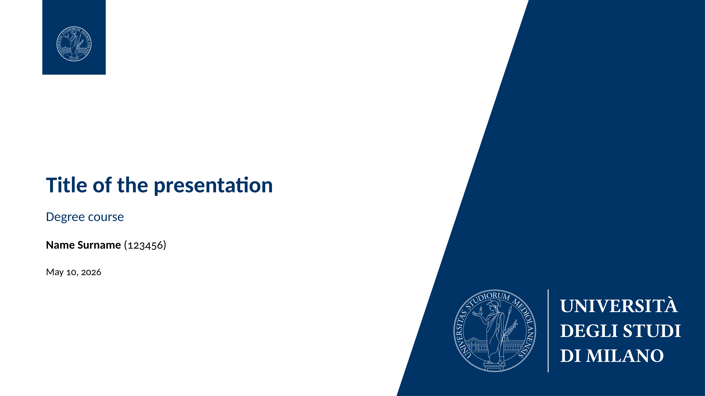

# simple-unimi-thesis 🎓

A simple [Typst](https://typst.app) thesis template for the University of Milan (UniMi). There are many templates available: this package has been built upon the [LIM LaTeX template](https://www.overleaf.com/project/641879675262cde2a670826b) (in Italian); while the the presentatation is based on [this](https://www.overleaf.com/latex/templates/la-statale-universita-degli-studi-di-milano-unimi-presentation/ykkwvfdbqydr) LaTeX template. Both are licensed under the CC BY 4.0 license.

See the [manual](docs/manual.pdf) for more information about the template (in Italian). Despite it being in Italian, the package supports English as well.

All the logos and images provided are property of the University of Milan (see [more](https://www.unimi.it/en/university/la-statale/communication/visual-identity)). To download other logos, see [this](https://work.unimi.it/servizi/comunicare/12902.htm) and [this](https://work.unimi.it/servizi/comunicare/37094.htm).

You'll have to download on your own the [Carlito](https://fonts.google.com/specimen/Carlito) font, which is the default for the presentation.

## Preview ✨

<p align="center">
  
  <br>
  <div align="center"><em>Frontispiece of the thesis</em></div>
</p>
<p align="center">
  
  <br>
  <div align="center"><em>Title page of presentation</em></div>
</p>

## Usage 🚀

Compile with:

```shell
typst c main.typ --pdf-standard a-3u
```

Quick start:

```typ
#import "@preview/simple-unimi-thesis:0.2.0": *

#show: unimi-thesis.with(
  title: "Thesis title",
  author: "Name Surname",
  serial-number: "123456",
  supervisors: (
    "Prof. First Supervisor",
  ),
  cosupervisors: (
    "Prof. First Cosupervisor",
  ),
  type-of-thesis: "Elaborato Finale",
  academic-year: [2026 --- 2027],
)

#show: frontmatter

// dedication

#show: dedication

// acknowledgements

#show: acknowledgements

= Acknowledgements

#lorem(100)

#toc // table of contents

#show: mainmatter

// main section of the thesis

= First chapter

#lorem(100)

= Second chapter

#lorem(100)

// appendix

#show: appendix

= First appendix

#lorem(100)

#show: backmatter

// bibliography

// associated laboratory
#closingpage()

```

### Presentation

Built on [Touying](https://typst.app/universe/package/touying/), the structure is quite standard:

```typ
#import "@preview/simple-unimi-thesis:0.2.0": *
#import "@preview/touying:0.7.3": *

#show: unimi-presentation.with(
  config-info(
    title: [Title of the presentation],
    course: [Degree course],
    author: [Name Surname],
    serial-number: [123456],
    date: datetime.today(),
  ),
)

#title-slide()

= First section

== First slide

#lorem(20)

#lorem(20)

== Second slide

#lorem(20)

#lorem(20)

= Second section

== First slide

#columns[
  #for i in range(0, 6) {
    [- #lorem(15) #pause]
  }
]

#focus-slide("Thanks for listening.")
```
